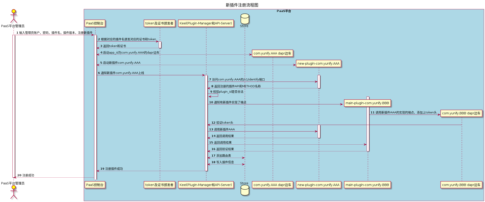

# keel

----

## What is keel

Keel provider basic plugin such as manager, auth, gateway.

## Demo Environment

TODO

## Features

The goal of this tutorial is to demonstrate the basic usage of the most popular tKeel features. You will learn how to:
 - Support Json Web Toke to devices;
 - Provider basic plugin;
 - Support extend plugin;
 - Security mechanism.

## Architecture

The diagram below shows key system components and interfaces they provide. Let’s walk through them.

## Latest Release
TODO

## Installation

TODO

### Quick Start

TODO

## Contributing, Support, Discussion, and Community
We :heart: your contribution. The [community](docs/community/README.md) walks you through how to get started contributing keel. The [development guide](docs/community/contribution/design-proposal-template.md) explains how to set up development environment.

Please submit any keel bugs, issues, and feature requests to [keel GitHub Issue](https://github.com/tkeel-io/keel/issues)

